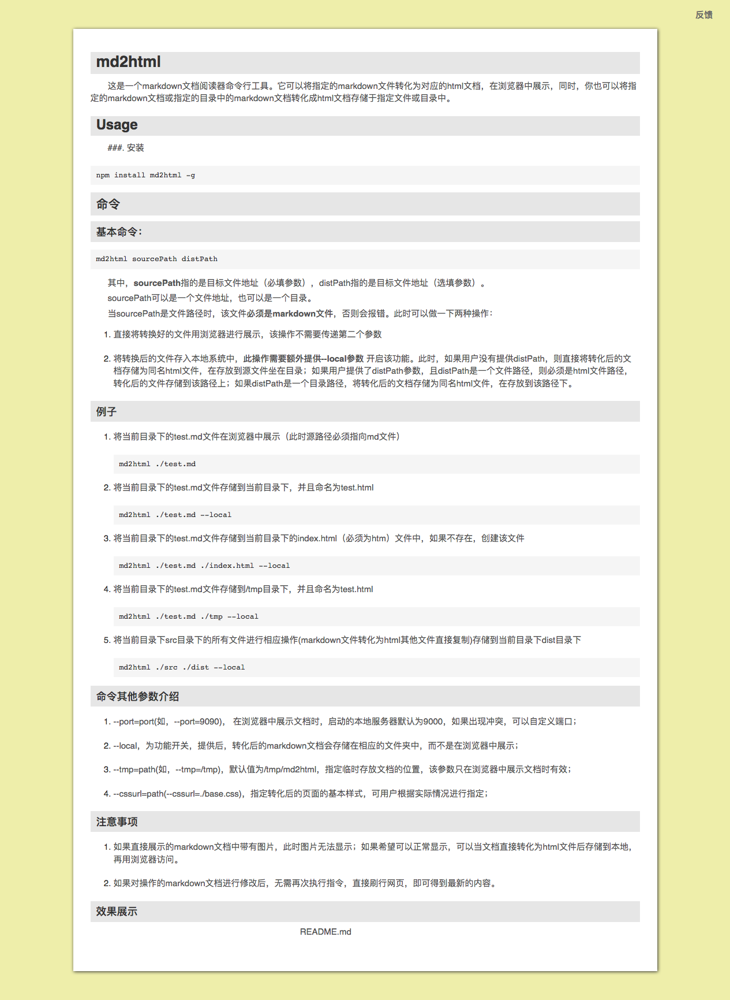

# md2html

这是一个markdown文档阅读器命令行工具。它可以将指定的markdown文件转化为对应的html文档，在浏览器中展示，同时，你也可以将指定的markdown文档或指定的目录中的markdown文档转化成html文档存储于指定文件或目录中。

## Usage
###. 安装

```
npm install yyp-md2html -g
```

### 命令
#### 基本命令：

```
md2html sourcePath distPath 
```
其中，**sourcePath**指的是目标文件地址（必填参数），distPath指的是目标文件地址（选填参数）。

sourcePath可以是一个文件地址，也可以是一个目录。

当sourcePath是文件路径时，该文件**必须是markdown文件**，否则会报错。此时可以做一下两种操作：

1. 直接将转换好的文件用浏览器进行展示，该操作不需要传递第二个参数

2. 将转换后的文件存入本地系统中，**此操作需要额外提供--local参数** 开启该功能。此时，如果用户没有提供distPath，则直接将转化后的文档存储为同名html文件，在存放到源文件坐在目录；如果用户提供了distPath参数，且distPath是一个文件路径，则必须是html文件路径，转化后的文件存储到该路径上；如果distPath是一个目录路径，将转化后的文档存储为同名html文件，在存放到该路径下。

#### 例子

1. 将当前目录下的test.md文件在浏览器中展示（此时源路径必须指向md文件）
```
md2html ./test.md
```

2. 将当前目录下的test.md文件存储到当前目录下，并且命名为test.html
```
md2html ./test.md --local
```

3. 将当前目录下的test.md文件存储到当前目录下的index.html（必须为htm）文件中，如果不存在，创建该文件
```
md2html ./test.md ./index.html --local
```

4. 将当前目录下的test.md文件存储到/tmp目录下，并且命名为test.html
```
md2html ./test.md ./tmp --local
```

5. 将当前目录下src目录下的所有文件进行相应操作(markdown文件转化为html其他文件直接复制)存储到当前目录下dist目录下
```
md2html ./src ./dist --local
```

#### 命令其他参数介绍

1. --port=port(如，--port=9090)， 在浏览器中展示文档时，启动的本地服务器默认为9000，如果出现冲突，可以自定义端口；

2. --local，为功能开关，提供后，转化后的markdown文档会存储在相应的文件夹中，而不是在浏览器中展示；

3. --tmp=path(如，--tmp=/tmp)，默认值为/tmp/md2html，指定临时存放文档的位置，该参数只在浏览器中展示文档时有效；

4. --cssurl=path(--cssurl=./base.css)，指定转化后的页面的基本样式，可用户根据实际情况进行指定；

#### 注意事项

1. 如果直接展示的markdown文档中带有图片，此时图片无法显示；如果希望可以正常显示，可以当文档直接转化为html文件后存储到本地，再用浏览器访问。

2. 如果对操作的markdown文档进行修改后，无需再次执行指令，直接刷行网页，即可得到最新的内容。

#### 效果展示


